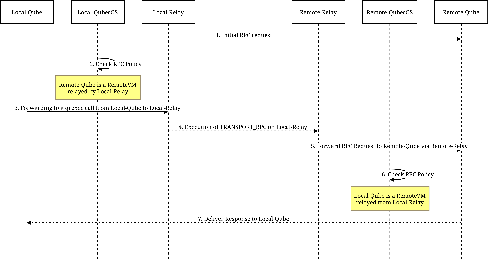
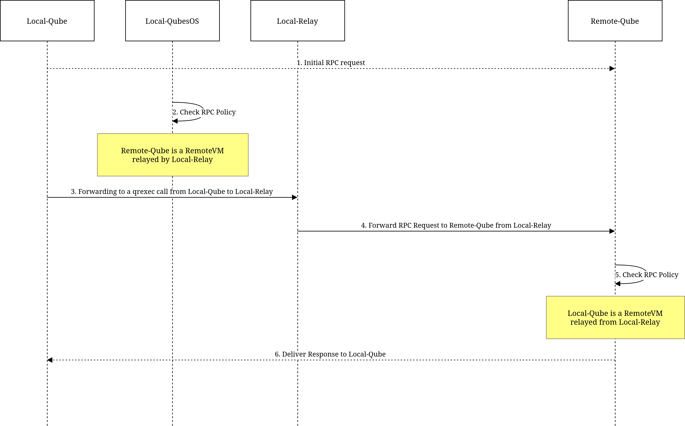

Service call to a RemoteVM
==========================

General case: From one Qubes OS to another Qubes OS
----------------------------------------------------

1. Initial RPC request from Local-Qube to Remote-Qube on Local-QubesOS
~~~~~~~~~~~~~~~~~~~~~~~~~~~~~~~~~~~~~~~~~~~~~~~~~~~~~~~~~~~~~~~~~~~~~~

   This is the starting point where ``Local-Qube`` on Local-QubesOS initiates an RPC request to ``Remote-Qube``,
   which is a RemoteVM. ``Local-Qube`` does not know that ``Remote-Qube`` is a RemoteVM on Remote-QubesOS.
   Assume the request is performed for the service ``my_service`` with argument ``my_arg``.

2. RPC Policy process on Local-QubesOS
~~~~~~~~~~~~~~~~~~~~~~~~~~~~~~~~~~~~~~

   Local-QubesOS processes the RPC request using its policy engine.
   It identifies that ``Remote-Qube`` is a RemoteVM, meaning it is not on Local-QubesOS but is accessible
   through ``Local-Relay``, which is a LocalVM on Local-QubesOS. ``Local-Relay`` is declared as the
   ``relayvm`` property of ``Local-Qube``.
   The communication between ``Local-Relay`` and ``Remote-Qube`` is facilitated using a RPC service
   specified by the ``transport_rpc`` property of ``Local-Qube`` (later called TRANSPORT_RPC) and available
   on ``Local-Relay``.

3. Making a Qrexec call from Local-Qube to Local-Relay
~~~~~~~~~~~~~~~~~~~~~~~~~~~~~~~~~~~~~~~~~~~~~~~~~~~~~~

   The original RPC request is relayed through a call made from ``Local-Qube`` to ``Local-Relay`` after the policy process.
   This request includes all the necessary information to reach ``Remote-Qube`` via ``Local-Relay``.
   The service name for this relayed call is:

   ``TRANSPORT_RPC+Remote-Qube+my_service+my_arg``

4. Execution of TRANSPORT_RPC on Local-Relay
~~~~~~~~~~~~~~~~~~~~~~~~~~~~~~~~~~~~~~~~~~~~

   Once ``Local-Relay`` receives the RPC request, it invokes the TRANSPORT_RPC service, passing along the original RPC request.
   In this execution, ``Local-Relay`` acts as an intermediary, packaging the request and forwarding it to its destination.
   It is important to note that at this level, the original ``qrexec`` request is forwarded by the TRANSPORT_RPC service,
   and Local-QubesOS ``dom0`` is not directly managing the connection.

   .. note::

      The ``Remote-Qube`` might not appear under the same name in Local-QubesOS.
      When creating a RemoteVM associated with ``Remote-Qube``, its original name is stored as a property,
      which is then made available in the ``Local-Relay`` QubesDB to establish a mapping between the local qube name
      and the original name. During TRANSPORT_RPC execution, QubesDB can be used to retrieve the correct name.

   .. note::

      In the case of SSH, you must first set up key sharing by copying the public keys across all jump relays.
      Additionally, you might consider leveraging the guidelines provided in
      `Proxies and Jump Hosts <https://en.wikibooks.org/wiki/OpenSSH/Cookbook/Proxies_and_Jump_Hosts>`_
      for further configuration options.

5. Remote-Relay forwards the RPC request to Remote-Qube on Remote-QubesOS
~~~~~~~~~~~~~~~~~~~~~~~~~~~~~~~~~~~~~~~~~~~~~~~~~~~~~~~~~~~~~~~~~~~~~~~~~

   TRANSPORT_RPC extracts the original service and argument, then forwards the request to ``Remote-Qube``
   by performing a qrexec from ``Remote-Relay``. The original source qube ``Local-Qube`` is specified as the
   ``qrexec-client-vm`` argument.

6. RPC policy process on Remote-QubesOS
~~~~~~~~~~~~~~~~~~~~~~~~~~~~~~~~~~~~~~~

   On Remote-QubesOS, the RPC policy engine processes the request to ensure that it complies with allowed policies:

   - Remote-QubesOS verifies that ``Local-Qube`` (via ``Remote-Relay``) is authorized to execute ``my_service``
     with the argument ``my_arg`` on ``Remote-Qube``.
   - If the policy allows, the request is executed, and the response is sent back along the same relay chain
     from ``Remote-Relay`` to ``Local-Relay``, and finally to ``Local-Qube``.

   .. note::

      The policy engine verifies that the correct relay is being used, but it has some limitations.
      For example, if you have ``AppVM1``, ``AppVM2``, and ``AppVM3`` behind ``Local-Relay``, the relay could
      misrepresent the origin of a request, claiming it came from ``AppVM1`` when it actually came from ``AppVM2``.
      However, ``Local-Relay`` cannot impersonate a request from ``AppVM4``, as ``AppVM4`` is not configured
      to route through ``Local-Relay``. To mitigate such risks, end-to-end verification could be added to ensure
      the integrity of the request throughout the entire communication chain. (Achieving full verification would
      require unpacking and verifying the request at the target ``dom0``, adding complexity and potential attack surface.)

   .. note::

      Refusing unknown connections is the simplest and most straightforward approach.
      In the future, it might be possible to implement a mapping system for connections from specific relays.
      For example, if you have ``AppVM1`` and ``AppVM2`` connected via ``Local-Relay``, any unrecognized connection
      through ``RelayVM1`` could be mapped to a designated RemoteVM (e.g., ``Local-Relay-unknown``).
      This would allow unexpected or misconfigured connections to be identifiable and managed rather than outright rejected.

Particular case: registering a RemoteVM not being on a QubesOS host
--------------------------------------------------------------------

The general design also allows defining and executing a call to a RemoteVM that is not a “qube” on a Qubes OS host.
By installing ``qrexec-client-vm`` on standard Linux or Windows machines, you can execute RPC on these platforms.
This is particularly interesting if you need to interact with, for example, KVM virtual machines, RaspberryPi devices,
standard computers with extensive resources, or computers with architectures different from those currently supported by Qubes OS.
It requires adapting the ``qrexec`` codebase to manage policies directly on the machine where ``qrexec-client-vm`` runs, rather than in ``dom0``.

In this particular case, assume that there is a LocalVM named ``Local-Relay`` and that ``Remote-Relay`` is running as a compatible
``qrexec-client-vm`` on a non-Qubes OS host. Since a RelayVM is itself a RemoteVM, simply define ``Remote-Relay`` as a standard
RemoteVM with the name ``Remote-Qube``, resulting in the following sequence diagram:

